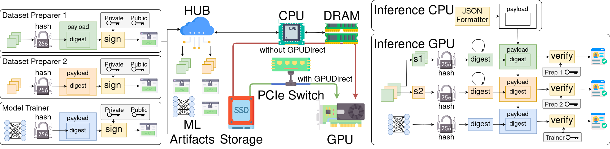

# Sentry

An end-to-end GPU framework for authenticating machine learning artifacts.




<!-- markdown-toc --bullets="-" -i README.md -->

<!-- toc -->

- [Overview](#overview)
- [Projects](#projects)
  - [Model Signing](#model-signing)
  - [SLSA for ML](#slsa-for-ml)
- [Status](#status)
- [Contributing](#contributing)

<!-- tocstop -->

## Overview

There is currently significant growth in the number of ML-powered applications.
This brings benefits, but it also provides grounds for attackers to exploit
unsuspecting ML users. This is why Google launched the [Secure AI Framework
(SAIF)][saif] to establish industry standards for creating trustworthy and
responsible AI applications. The first principle of SAIF is to

> Expand strong security foundations to the AI ecosystem

Building on the work with [Open Source Security Foundation][openssf], we are
creating this repository to demonstrate how the ML supply chain can be
strengthened in _the same way_ as the traditional software supply chain.

This repository hosts a collection of utilities and examples related to the
security of machine learning pipelines. The focus is on providing *verifiable*
claims about the integrity and provenance of the resulting models, meaning users
can check for themselves that these claims are true rather than having to just
trust the model trainer.

## Setup
We support three ways of running Sentry: Docker and native run.

### Docker
[Docker](https://docs.docker.com/get-started/get-docker/)  
[Docker Compose](https://docs.docker.com/compose/install/)   
[Nvidia Container Toolkit](https://docs.nvidia.com/datacenter/cloud-native/container-toolkit/latest/install-guide.html)
```
mkdir -p ./signatures
```

### Native run
```
python3 -m venv .venv
source .venv/bin/activate

export TORCH_HOME=./torch

pip install -r requirements.txt

openssl ecparam -name prime256v1 -genkey -noout -out private.pem
openssl ec -in private.pem -pubout -out public.pem

export CUFILE_ENV_PATH_JSON=cufile.json

nvcc -Xcompiler '-fPIC' -o ./RapidEC/gsv.so -shared ./RapidEC/gsv.cu

mkdir -p ./signatures
```

### Huggingface login
Some ML models from huggingface require a user to be logged in to avoid timeout errors.  
Create an account and follow the [guide](https://huggingface.co/docs/hub/en/security-tokens) to acquire your access token.  
Then, place the access token in the file named 'hf_access_token'.

## Run

### Docker
```
docker compose up --build sentry_dataset
docker compose up --build sentry_trainer
docker compose up --build sentry_inferencer
```

### Native run
```
python agent_dataset.py uoft-cs/cifar10 16 1 dataset/cifar10
python agent_trainer.py --sig_out /home/signatures --model_path /home/torch private-key --private_key private.pem
python agent_inferencer.py --sig_out /home/signatures --model_path /home/torch private-key --private_key private.pem
```

## Projects

Currently, there are two main projects in the repository: model signing (to
prevent tampering of models after publication to ML model hubs) and
[SLSA](https://slsa.dev/) (to prevent tampering of models during the build
process).

### Model Signing

This project demonstrates how to protect the integrity of a model by signing it
with [Sigstore](https://www.sigstore.dev/), a tool for making code signatures
transparent without requiring management of cryptographic key material.

When users download a given version of a signed model they can check that the
signature comes from a known or trusted identity and thus that the model hasn't
been tampered with after training.

We are able to sign large models with very good performance, as the following
table shows:

| Model              | Size  |  Sign Time | Verify Time |
|--------------------|-------|:----------:|:-----------:|
| roberta-base-11    | 8K    | 1s         | 0.6s        |
| hustvl/YOLOP       | 215M  | 1s         | 1s          |
| bertseq2seq        | 2.8G  | 1.9s       | 1.4s        |
| bert-base-uncased  | 3.3G  | 1.6s       | 1.1s        |
| tiiuae/falcon-7b   | 14GB  | 2.1s       | 1.8s        |
